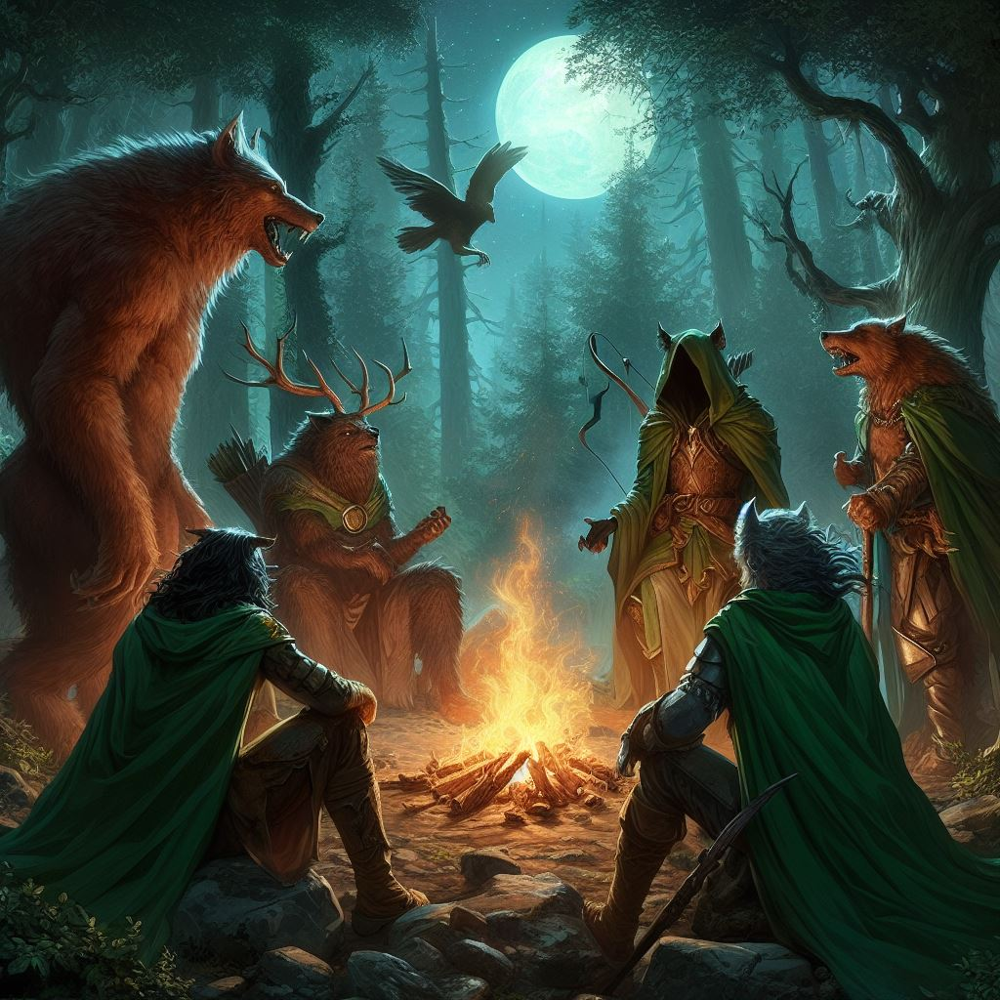

# Druid

Work in progress: Druid is being built toward this design, and current game
behavior differs in places.

Druids serve Gaea through grove, storm, root, beast, moon, water, stone, fire,
rot, and renewal. The sea and stone, the storm and sun, the animals and plants,
the patient work of decay, and the first green push after ruin all belong to
their circle.

## In Play

A Druid reads the ground first. Forest, swamp, desert, cave, storm, moonlight,
and sacred grove all change which rites feel near at hand.

- Read the terrain
- Gather components and profession materials
- Tend a sacred grove
- Use rites that match the land, path, and form
- Craft Druid-only Alchemy blueprints
- Master favorite rites through real use

## Natural Attunement

Natural Attunement rises through rite use, grove service, harvesting, path
practice, living pilgrimages, and acts that restore natural balance.

| Rank | Opens |
| --- | --- |
| Seed | Calm Animal, Spirit Aura, Thorns, Produce Flame, Gust, Water of Life, grove planting, basic forage |
| Root | Create Water, Warp Wood, Growth, Stoneskin, Wild Speed, Wild Strength, Scry, Frighten, basic Verdant Alchemy |
| Bloom | Wolf Form, Water Walk, Frost Bolt, Flame Blade, Frost Blade, Whirlwind |
| Branch | Bear Form, Hawk Form, Entangle, Purify Blood, Taint Blood, Nature Step, Befriend Animal |
| Canopy | Serpent Form, Call Ravens, Resist Poison, Wind Walk, Resist Cold, Eagle Eye |
| Thorn | Resist Lightning, Locust Swarm, Resist Fire, Sunray, Mire, Call Lightning |
| Stone | Earth Meld, Shatter, Earthquake, advanced grove communion |
| Rain | Renewal, Inferno, Drown, improved components, stronger sanctuary work |
| Elderwood | Conjure Elemental, Reincarnate, ancient grove benefits |
| Verdant Myth | Deep path capstones, elder lunar rites, grove miracles |

Rite mastery moves from Known to Practiced, Fluent, Rootbound, and Elder. Higher
mastery improves cost, recovery, terrain hooks, grove hooks, form hooks, and
component use.

## Sacred Grove

Every Druid has a sacred grove planted in the wild. It grows through care,
components, and plant or renewal magic used nearby.

| Grove Stage | Use |
| --- | --- |
| Seedling | Faint recovery and a visible bond |
| Sapling | Clearer answers from the grove |
| Young Grove | Component storage, recovery, and personal rites |
| Mature Grove | Inner sanctum, deeper communion, reduced rite costs |
| Ancient Grove | Safety, memory, shared respect, stronger grove pulse |

| Grove Focus | Benefit |
| --- | --- |
| Garden | More herbs, rarer components, stronger plant work |
| Cavern | Stone, endurance, underground routes, earth memory |
| Sacred Pool | Healing, recovery, water rites, reflection |
| Archery Glade | Wind, sight, ravens, ranged nature magic |
| Primal Clay | Wild shape, beast memory, body change |
| Moonwell | Lunar alignment, tide, gravity, and astral rites |

## Terrain And Components

| Terrain | Druid use |
| --- | --- |
| Forest, jungle, swamp | Plant rites, animal contact, thorns, entangle, wolf, bear, serpent |
| Plains, hills, path, farm | Movement rites, beast forms, weather signs, ravens |
| River, lake, sea, beach | Water rites, cleansing, tidecall, drowning work, moon work |
| Mountain, cavern, underground | Stone rites, earthmeld, endurance, elementals |
| Desert, barren land, ash fields | Fire, sun, drought, endurance, difficult component work |
| Sky and open weather | Wind, storm, lightning, hawk, ravens, moon signs |

Attunement reads the current terrain. Favorable terrain strengthens forms and
changes certain rites.

## Harvesting And Verdant Alchemy

Druids use [Professions](../professions.md) as part of guild life. Herbalism
turns wild herbs into potions, poultices, grove offerings, rite catalysts, and
blueprint ingredients.

| Blueprint Family | Examples | Use |
| --- | --- | --- |
| Poultices and balms | Grove Poultice, Renewal Salve, Rootmender Balm | Healing, recovery, poison care |
| Wards and oils | Barkskin Resin, Storm Oil, Moon-Glass Wash | Defensive buffs and rite prep |
| Lures and bonds | Beast Lure, Raven Feed, Elemental Salt | Follower handling and summon focus |
| Terrain catalysts | Mire Spores, River-Stone Tincture, Skyseed Incense, Ashfield Ember | Shapes the next matching rite |
| Grove offerings | Seed Cakes, Root Tea, Moonwell Dew, Ancient Compost | Grove growth and root-stash expansion |
| Rebirth preparations | Last Breath Moss, Reincarnation Seed, Green Grave Oil | Renewal and reincarnation |

Blueprints unlock through Alchemy, Attunement, path work, and grove stage.

## Paths And Spheres

| Path | Theme | Rites |
| --- | --- | --- |
| Nurture | Healing, growth, cleansing, safe passage | Water of Life, Create Water, Purify Blood, Renewal |
| Erosion | Rot, venom, blight, breaking false permanence | Taint Blood, Mire, Shatter, Locust Swarm |
| Harmony | Balance, resistance, aura, sanctuary | Spirit Aura, Rainbow Aura, resistances, grove pulse |
| Convergence | Flesh, stone, beast, element, transformation | Wild Shape, Stoneskin, Enlarge Animal, Conjure Elemental |
| Impulse | Storm, speed, hunger, predatory motion | Gust, Wild Speed, Call Ravens, Call Lightning |
| Lunar | Moon, tide, gravity, mists, astral roads | Moonbeam, Moonlit Mists, Lift, Tidecall, Astral Walk |

Spheres are the spell lenses: Animal for companions and forms, Plant for growth
and thorns, Water for healing and drowning, Air for wind and storm, Earth for
stone and endurance, Fire for heat and harsh renewal.

## Wild Shape And Followers

Druid forms are spirit-forms learned through Gaea's mysteries.

| Form | Use | Favored terrain |
| --- | --- | --- |
| Wolf | Evasion, pursuit, fast hunting | Forest, jungle, swamp, plains, hills, path |
| Bear | Endurance, body strength, punishment | Forest, jungle, swamp, plains, hills, path |
| Hawk | Scouting, agility, sky movement | Sky, mountain, forest, plains, jungle, hills |
| Serpent | Venom, strength, tight places | Swamp, jungle, forest, underground, river, lake |

| Ally | Use |
| --- | --- |
| Befriended animal | Natural companion won through trust and rite work |
| Befriended plant | Rooted or ambulatory plant ally shaped by Gaea's spirit |
| Ravens | Short-lived swarm for distraction and harrying |
| Air elemental | Speed, disruption, lightning and wind resistance |
| Earth elemental | Durability, stone force, stability |
| Fire elemental | Aggression, heat, burning force |
| Water elemental | Recovery, flow, cold and drowning themes |

## Rites

| Rite Family | Rites |
| --- | --- |
| First rites | Calm Animal, Spirit Aura, Thorns, Produce Flame, Gust, Water of Life |
| Growth and body | Create Water, Warp Wood, Growth, Stoneskin, Endurance, Wild Speed, Wild Strength |
| Sight and fear | Scry, Frighten, Eagle Eye |
| Blades and cold | Frost Bolt, Flame Blade, Frost Blade, Sky Blade, Ice Storm |
| Movement | Water Walk, Nature Step, Wind Walk, Earth Meld |
| Binding and terrain | Entangle, Mire, Shatter, Earthquake, Engulf |
| Blood and balance | Purify Blood, Taint Blood, Rainbow Aura, Resist Poison, Resist Cold, Resist Lightning, Resist Fire |
| Beasts and allies | Enlarge Animal, Befriend Animal, Call Ravens, Conjure Elemental |
| Storm and disaster | Whirlwind, Exterminate, Locust Swarm, Sunray, Call Lightning, Inferno, Drown |
| Restoration and cycle | Renewal, Reincarnate |
| Wild shape | Wolf Form, Bear Form, Hawk Form, Serpent Form |

## Lunar Rites

| Lunar Rite | Use |
| --- | --- |
| Lunar Alignment | Reads the three moons and their present influence |
| Moonbeam | Calls moonlight as direct force |
| Moonlit Mists | Uses mist, reflection, and moon-shadow for defense |
| Moon Reflection | Turns moonlight into scrying and omen work |
| Lift | Bends gravity around a creature or object |
| Tidecall | Pulls water, blood, and weather through moon force |
| Moon Swarm | Calls restless lunar force around enemies |
| Scourge | Turns harsh moonlight into punishment |
| Moonblade | Shapes a temporary weapon from moonlight and sky force |
| Astral Walk | Travels through moonlit spirit roads |

Dailos brings disease and change. Markas brings sanctuary and healing. Tekal
brings knowledge, balance, and strange gravity.

## Restrictions

Druids favor leather, hide, wood, bone, stone, cloth, plant fiber, silver, and
gold. Heavy plate and most forged metal armor break the covenant. Sickles,
daggers, staves, spears, polearms, bows, thrown weapons, and simple blunts fit.
Extreme holiness or corruption disrupts spellcasting.

## Field Commands

| Command | Use |
| --- | --- |
| `dscore` | Shows Druid status, terrain, grove, components, and known powers |
| `attune` | Reads the current terrain |
| `dcomponents` | Shows carried Druid components |
| `professions`, `reagents` | Shows profession progress or stored materials |
| `gather herbs`, `forage components` | Harvests herbs or natural components |
| `grove plant`, `grove status` | Plants or checks a personal sacred grove |
| `grove stash` | Stores or retrieves components from the grove |
| `groves`, `commune` | Lists mature groves or enters a grove sanctum |
| `study`, `learn`, `meditate`, `master` | Reviews, learns, or deepens powers |
| `begin`, `quickcraft`, `read`, `manufacture` | Uses Alchemy and blueprints |
| `wildshape <form>`, `unshift` | Enters or leaves spirit-form |
| `release`, `dismiss`, `secure`, `allow` | Manages followers and carried items |
| `unleash`, `heel`, `toggle` | Controls follower combat behavior |
| `dchat`, `edchat`, `dhist` | Uses the Druid channel |
| `gaea`, `egaea`, `gaeahist` | Uses the shared Gaean nature channel |
